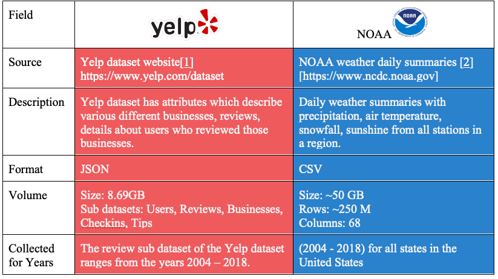
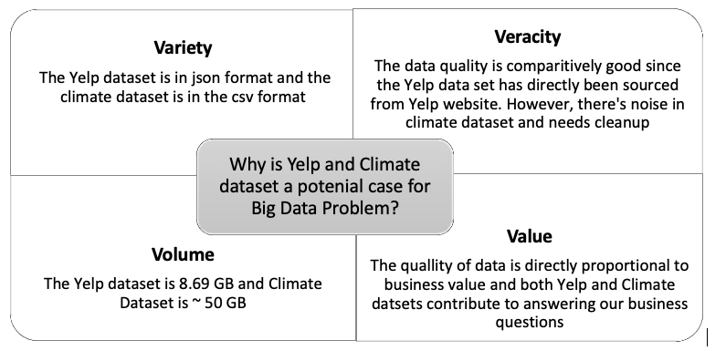

# Yelp-Weather

## Objective: 

Utilize [Yelp](https://www.yelp.com/dataset/documentation/main) and [NOAA weather](https://www1.ncdc.noaa.gov/pub/data/cdo/documentation/GHCND_documentation.pdf)  datasets to probe into descriptive and predictive analytic business questions. Also engineer this data effectively in a NoSQL database(Apache Cassandra), to make querying and analysing optimal.

## Technologies Used

- Apache Cassandra
- Python

## Datasets

## Why is this a BigData Problem?

